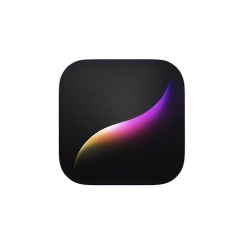
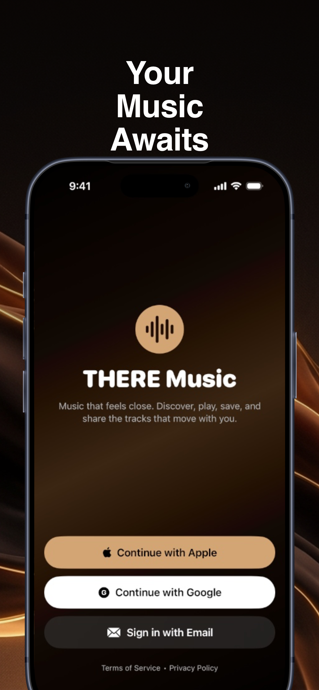
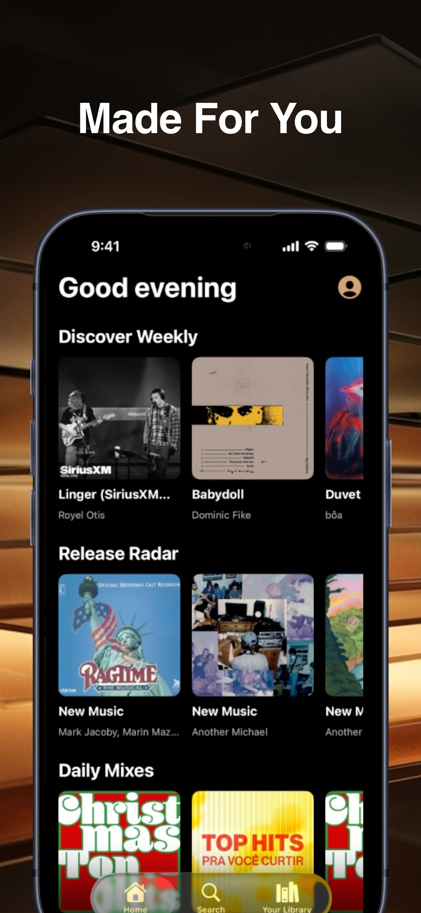
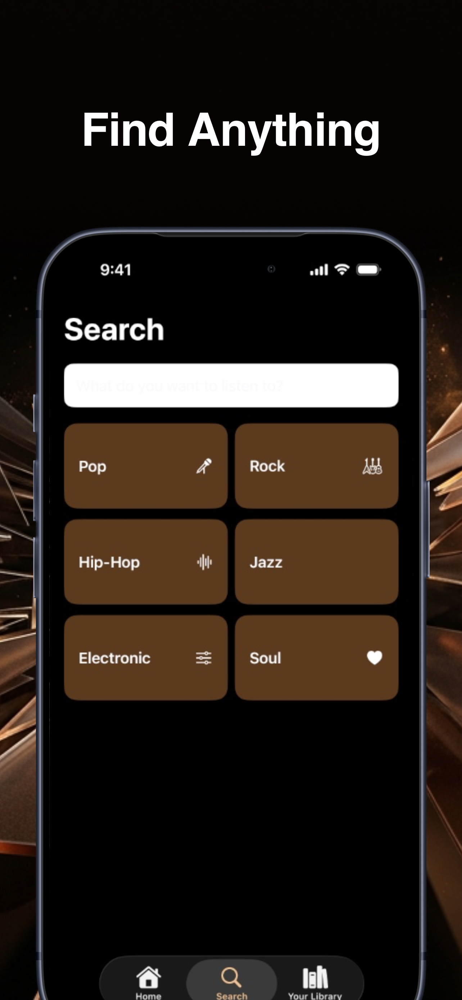
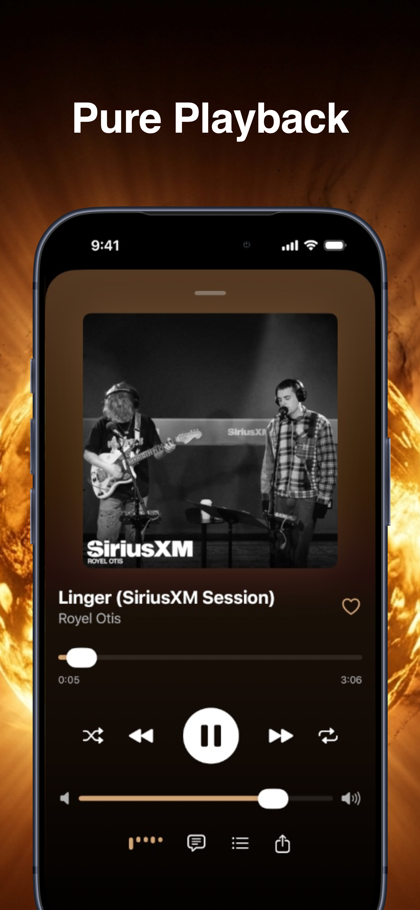
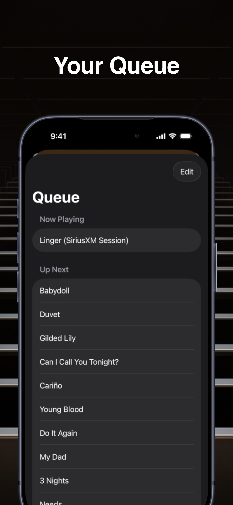
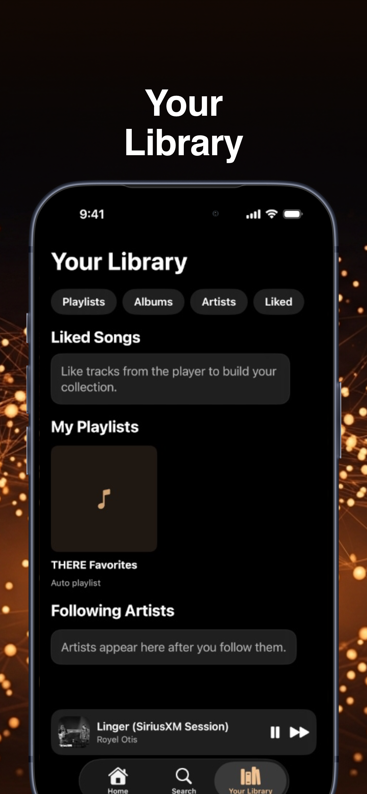

# THERE Music

<div align="center">
  
  
  <p><strong>Open-source iOS music streaming application</strong></p>
  
  [](https://developer.apple.com/ios/)
  [](https://swift.org)
  [](LICENSE)
  [](https://developer.apple.com/xcode/swiftui/)
</div>

---

## Screenshots

<div align="center">
  
  
  
  
</div>

<div align="center">
  
  
</div>

---

## About

THERE Music is an open-source iOS music streaming application built with SwiftUI. Supports **Spotify API** and **SoundCloud API** for music playback and discovery.

### Features

- Authentication via Apple, Google, or Email/Password
- Personalized home feed with recommendations
- Real-time search with genre filtering
- Library management for songs, albums, and playlists
- Full-featured audio player with queue management
- Track comments and social features
- Dark theme with warm brown color palette

---

## Tech Stack

**Frameworks**


- SwiftUI for UI
- Combine for reactive state management
- AVFoundation for audio playback
- CoreData for local persistence
- AuthenticationServices for Sign in with Apple
- CryptoKit for password hashing
- Keychain for secure token storage

**Architecture**

- MVVM (Model-View-ViewModel)
- Repository Pattern
- Dependency Injection
- async/await for concurrency

**APIs**

- Spotify API
- SoundCloud API
- iTunes Search API
- Last.fm API

---

## Requirements

- iOS 17.0+
- Xcode 15.0+
- Swift 5.9+

---

## Installation

**1. Clone the repository**

```bash
git clone https://github.com/clexec/Mono.git
cd Mono
```

**2. Open in Xcode**

```bash
open ios-there-music/Monk.xcodeproj
```

**3. Configure API keys**

Create `Config.swift` in the project:

```swift
enum APIConfig {
    static let spotifyClientID = "YOUR_SPOTIFY_CLIENT_ID"
    static let spotifyClientSecret = "YOUR_SPOTIFY_CLIENT_SECRET"
    static let soundCloudClientID = "YOUR_SOUNDCLOUD_CLIENT_ID"
    static let lastFMAPIKey = "YOUR_LASTFM_API_KEY"
}
```

**4. Build and run**

Press `Cmd + R` in Xcode

### API Keys

- Spotify: [developer.spotify.com](https://developer.spotify.com/)
- SoundCloud: [developers.soundcloud.com](https://developers.soundcloud.com/)
- Last.fm: [last.fm/api](https://www.last.fm/api)

---

## License

MIT License. See [LICENSE](LICENSE) for details.

---

## Acknowledgments

Built with Apple's native frameworks. Music data provided by Spotify, SoundCloud, iTunes, and Last.fm APIs.

---

<div align="center">
  <p>Made with SwiftUI</p>
</div>
